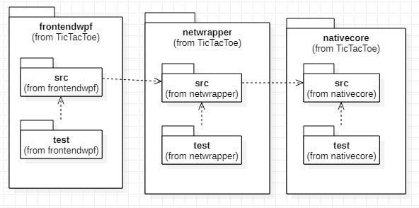

# Tic Tac Toe architecture

## about

[arc42](https://arc42.org/) is a nice brainstorming template to find relevant stuff that can be documented in an arhitecture document. It is meant as a complementary frame where things can be noted when they become relevant.

I am grabbing [star uml](http://staruml.io/) to draw my diagrams and I create screenshots to export them. I like the program enough that I am considering purchasing it some time down the road.

## packages

This rough sketch shows how I plan to structure my work.

- Obviousely everything will contain unit tests.
- wpf will be decoupled through mvvm for testing.
- wpf will also feature gui tests.
- netwrapper will include tests to show marshalling is handled correctly.
- native core tests will likely need mocking.
